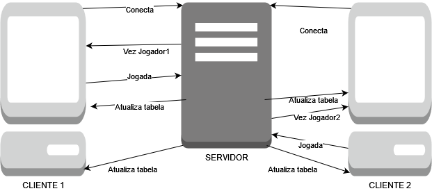

# Connect4 

## Descrição
Connect4 é um jogo multiplayer baseado no clássico jogo de tabuleiro. Ele permite que dois jogadores joguem remotamente conectados ao mesmo servidor através do terminal.

Os jogadores devem:
- Conectar ao servidor usando o  `cliente.py`.
- Fazer suas jogadas alternadamente, tentando alinhar 4 símbolos iguais (horizontalmente, verticalmente ou diagonalmente) no tabuleiro.

---

## Requisitos
- **Python 3.8+**
- **Terminal com suporte a scripts Python**
- Rede local ou localhost para conexões cliente-servidor.

---

## Como Executar

1. **Clone este repositório**
   ```bash
   git clone https://github.com/Reinaldo-Kn/connect4
   cd https://github.com/Reinaldo-Kn/connect4

2. **Inicie o servidor**
   ```bash
    python3 servidor.py || python servidor.py
    ```
3. **Conecte os jogadores**
   ```bash
    python3 cliente.py || python cliente.py
    ```
Cada cliente representará um jogador. Assim que ambos se conectarem, o jogo começa.

---

### Regras do Jogo Connect4

1. **Objetivo do Jogo**  
   O objetivo é alinhar 4 peças do seu símbolo (X ou O) consecutivamente, seja horizontalmente, verticalmente ou diagonalmente.

2. **Turnos**  
   - O jogador 1 (X) sempre começa a partida.  
   - Os jogadores jogam alternadamente, escolhendo uma coluna para inserir sua peça.  

3. **Escolha da Coluna**  
   - Cada jogador deve selecionar uma coluna válida (0 a 6) para jogar.  
   - Caso a coluna esteja cheia ou a escolha seja inválida, o jogador precisará tentar novamente.

4. **Condições de Vitória**  
   - O jogo termina quando um jogador consegue alinhar 4 peças consecutivas.  
   - Caso o tabuleiro esteja completamente preenchido e ninguém vença, a partida termina empatada.

5. **Reinício do Jogo**  
   - Após o término de uma partida, ambos os jogadores podem decidir se desejam jogar novamente.  
   - Caso qualquer jogador escolha "não", o jogo será encerrado.

6. **Placar**  
   - Um placar cumulativo das vitórias de cada jogador é mantida durante a sessão.

---

### Tipos e Fluxo de Mensagens

1. **Mensagens do Servidor para os Clientes**  
   - **Início de Turno**: O servidor solicita que o jogador da vez escolha uma coluna válida (0 a 6).  
   - **Atualização do Tabuleiro**: Após cada jogada, o servidor envia o tabuleiro atualizado para ambos os jogadores.  
   - **Notificação de Jogada Inválida**: Caso um jogador escolha uma coluna inválida ou cheia, o servidor solicita uma nova entrada.  
   - **Condições de Vitória ou Empate**: O servidor notifica os jogadores quando ocorre uma vitória ou empate, atualizando também o placar.  
   - **Reinício do Jogo**: Após uma partida, o servidor pergunta a ambos os jogadores se desejam jogar novamente.  
   - **Encerramento**: O servidor informa aos jogadores que o jogo foi encerrado.

2. **Mensagens dos Clientes para o Servidor**  
   - **Escolha da Coluna**: O jogador envia ao servidor a coluna escolhida para realizar sua jogada.  
   - **Resposta ao Reinício**: Após uma partida, os jogadores enviam suas respostas ("s" para sim ou "n" para não) indicando se desejam continuar jogando.

3. **Fluxo de Mensagens**  
   - O servidor aguarda as conexões de dois clientes (jogadores).  
   - Durante cada turno, o servidor solicita a jogada do jogador ativo e aguarda sua resposta.  
   - O servidor processa a jogada, atualiza o tabuleiro e envia as informações para ambos os jogadores.  
   - Caso a partida termine, o servidor pergunta se os jogadores desejam reiniciar e age conforme as respostas.  
   - O ciclo se repete até que pelo menos um jogador escolha não continuar, encerrando a sessão.

   